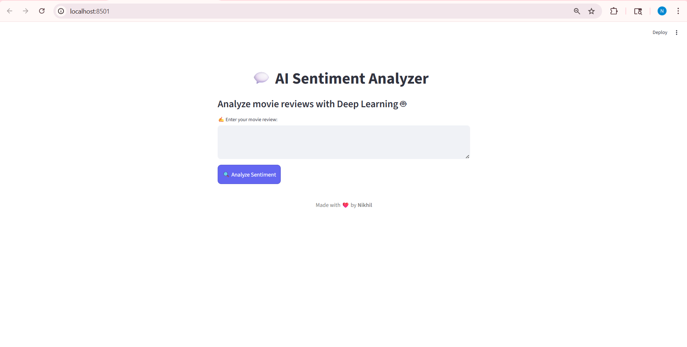
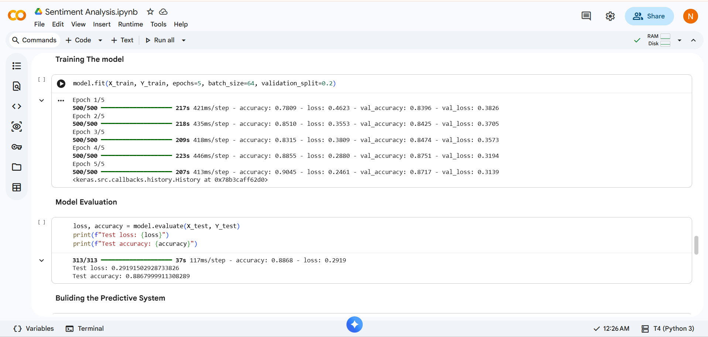

# 💬 Sentiment Analysis using LSTM (Deep Learning)

## 📌 Overview

This project is a Deep Learning-based Sentiment Analysis system that classifies movie reviews as **Positive 😊** or **Negative 😠**.
It uses an LSTM (Long Short-Term Memory) model to understand the context of text and predict sentiment.

The project is built and trained in Google Colab and deployed as a web application using Streamlit.

---

## 🚀 Features

* Real-time sentiment prediction from user input
* Deep Learning model using LSTM
* Tokenization and sequence padding
* Clean and interactive web UI
* Handles custom movie reviews

---

## 🧠 Model Architecture

* Embedding Layer
* LSTM Layer
* Dense Layer (Sigmoid Activation)

---

## 🛠️ Tech Stack

* Python
* TensorFlow / Keras
* Streamlit
* NumPy
* Pickle

---

## 📂 Project Structure

```
Sentiment-Analysis/
│
├── app.py
├── sentiment_model.h5
├── tokenizer.pkl
├── config.json
├── requirements.txt
└── README.md
```

---

## ⚙️ Installation & Setup

### 1. Clone the repository

```
git clone https://github.com/Nikson1105/sentiment-analysis.git
cd sentiment-analysis
```

### 2. Create virtual environment

```
python -m venv venv
venv\Scripts\activate
```

### 3. Install dependencies

```
pip install -r requirements.txt
```

---

## ▶️ Run the App

```
streamlit run app.py
```

---

## 🧪 Example

**Input:**
"The movie had amazing visuals but the story was weak."

**Output:**
Negative 😠

---

## 📊 Results

* Achieved good accuracy on test dataset
* Performs well on unseen user inputs
* Handles mixed sentiment reviews

---

## 🔮 Future Improvements

* Add Neutral sentiment class
* Improve accuracy using Bidirectional LSTM
* Use pre-trained embeddings (GloVe)
* Deploy on cloud (Streamlit Cloud)

---

## 👨‍💻 Author

**Nikhil Sonawane**

* GitHub: https://github.com/Nikson1105

---

## ⭐ Acknowledgements

* TensorFlow Documentation
* Streamlit Community
* Google Colab


## 📸 App Preview

### 🖥️ User Interface


### 😊 Positive Prediction


### 😠 Negative Prediction


---

## 📊 Model Performance


